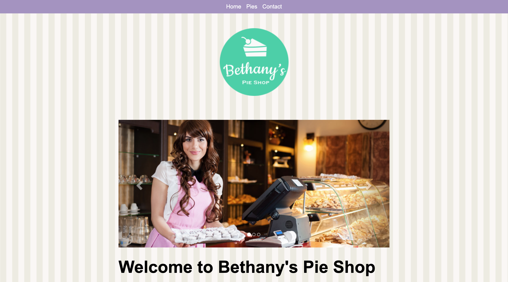

# Bethany's Pie Shop

Bethany's Pie Shop offers a website where customers can order pies online. This is a course project for a Pluralsight course – [Building Websites with HTML, CSS, and JavaScript: Getting Started](https://app.pluralsight.com/library/courses/html-css-javascript-getting-started-building-websites).

## Table of contents

- [Overview](#overview)
  - [The challenge](#the-challenge)
  - [Screenshot](#screenshot)
  - [Links](#links)
- [Process](#process)
  - [Built with](#built-with)
  - [What I learned](#what-i-learned)
- [Author](#author)

## Overview

### The challenge

Users should be able to:

- View the optimal layout depending on their device's screen size
- Navigate the page via a navigation menu
- See hover and focus states for interactive elements
- Order an item from the website

### Screenshot



### Links

- Repository URL: [https://github.com/jeanpierretouma/pluralsight-building-websites-with-html-css-and-javascript-getting-started](https://github.com/jeanpierretouma/pluralsight-building-websites-with-html-css-and-javascript-getting-started)
- Live Site URL: [jeanpierretouma.github.io/pluralsight-building-websites-with-html-css-and-javascript-getting-started](jeanpierretouma.github.io/pluralsight-building-websites-with-html-css-and-javascript-getting-started)

## Process

### Built with

- Mobile-first workflow
- Semantic HTML5 markup
- Flexbox
- JavaScript
- LocalStorage API
- Geolocation API

### What I learned

I learned the basics of JavaScript like variables, functions, arguments, objects, object literals, template literals and much more.

Throughout the course, I used these principles to achieve several goals:

- Add a click function to the order buttons inside the pie cards by using the ```addEventListener``` method to target the clicked button and gather information about the order such as title, price, and description.

- Identify the ordered pie's information in an object literals and then store them locally by using the LocalStorage API and thereafter redirect the pies.html page to order.html to populate the form.

- Retrieve the stored order information from LocalStorage and display them on the order.html page in the pie card section.

- Send hidden order information and geolocation information when the form is submitted.

## Author

- Website - [Jean-Pierre Touma](https://github.com/jeanpierretouma)
- Pluralsight - [Jean-Pierre Touma](https://app.pluralsight.com/profile/jeanpierretouma)